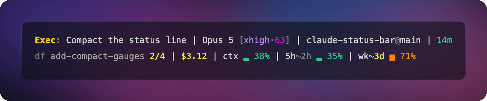

# claude-status-bar

[](https://github.com/jeancarlo-javier/claude-status-bar/releases)
[](LICENSE)
[](https://www.claudepluginhub.com/plugins/jeancarlo-javier-claude-status-bar?ref=badge)

Two-line Claude Code status line. The headline feature: the session's live **workflow
phase** (`Plan:`, `Exec:`, `Verify:`, …) and its subject, color-coded and rewritten by the
model itself as the work progresses. The rest is the session context you want on screen
anyway.



## How it works — three layers

1. **Teach** — a rule in `~/.claude/CLAUDE.md` (see `docs/global-claude-rule.md`) defines the
   `Phase: subject` format and requires a rewrite at every phase transition:
   `echo "Exec: subject" > ~/.claude/session-context/$CLAUDE_CODE_SESSION_ID`
2. **Remind** — the nudge hook re-surfaces the rule only when the file is stale (>10 min) or
   missing. Fresh file → zero tokens injected.
3. **Enforce** — the guard blocks the first stop of a session that never wrote the file.
   `stop_hook_active` prevents loops; an existing non-empty file makes it permanently silent.

The store is `~/.claude/session-context/<session_id>` — one plain-text file per session,
shared across all Claude config dirs (the scripts always resolve `~/.claude/` regardless of
`CLAUDE_CONFIG_DIR`).

## Install

```bash
claude plugin marketplace add jeancarlo-javier/claude-status-bar
claude plugin install claude-status-bar@claude-status-bar
```

Then restart Claude Code twice: the first start configures, the second renders.

Installing wires the hooks. A plugin cannot set a `statusLine` or edit your global `CLAUDE.md`
directly, so a `SessionStart` hook does it on first launch — it points `statusLine` at the
renderer in `~/.claude/settings.json` and appends the phase rule to `~/.claude/CLAUDE.md`,
between `claude-status-bar:begin`/`:end` markers. It is silent on every later start.

It never overwrites a status line you already have; if you have one, it says so and leaves it
alone. `/claude-status-bar:init` switches over when you want that. Plugin updates re-point the
path automatically.

To remove: `claude plugin uninstall claude-status-bar@claude-status-bar`, then delete the
`claude-status-bar:begin`/`:end` block from `~/.claude/CLAUDE.md`, and — only if it still points
at `claude-code-status.js` — the `statusLine` key from `~/.claude/settings.json`. Also
`rm ~/.claude/.claude-status-bar-noticed`, the flag that keeps the one-time notice from repeating.

<details>
<summary>Manual install, without the plugin system</summary>

Paste this into Claude Code:

````markdown
Install this status line: https://github.com/jeancarlo-javier/claude-status-bar

Clone it to ~/.claude/claude-status-bar, then wire it in ~/.claude/settings.json:
- statusLine → bin/claude-code-status.js
- Stop hook → hooks/session-context-guard.js
- UserPromptSubmit hook → hooks/session-context-nudge.js

Plus append the rule from docs/global-claude-rule.md to ~/.claude/CLAUDE.md.
Verify it renders, then tell me to restart.
````

</details>

## Files

| File | Role |
|------|------|
| `bin/claude-code-status.js` | Status line renderer (`statusLine` command, not a hook). Reads `~/.claude/session-context/<session_id>`, parses `Phase: subject`, renders it color-coded. |
| `hooks/session-context-nudge.js` | `UserPromptSubmit` hook. Silent while the phase file is fresh (<10 min); injects a short reminder when it's stale or missing. Also intercepts `-hd` to check off the health reminder without spending a turn. |
| `hooks/session-context-guard.js` | `Stop` hook. Blocks turn completion (max once per session) if the phase file was never written — the deterministic enforcement layer. |
| `docs/global-claude-rule.md` | The global CLAUDE.md rule that teaches the model the format and when to write. |
| `.claude-plugin/` | Plugin and marketplace manifests, so the repo installs as a Claude Code plugin. |
| `hooks/hooks.json` | Wires all three hooks automatically when installed as a plugin. |
| `hooks/plugin-setup.js` | `SessionStart` hook. Self-configures the status line and the CLAUDE.md rule on first launch; silent afterwards. |
| `skills/init/SKILL.md` | `/claude-status-bar:init` — repair path, for switching from another status line or restoring a deleted rule. |

## Phases and colors

Phases are **dynamic** — any short English label works; unknown labels render bold grey (250).
Canonical labels are English. Semantic palette (256-color):

| Phase | Color | Meaning |
|-------|-------|---------|
| `Research:` | 176 orchid | thinking |
| `Plan:` | 111 blue | thinking |
| `Review-Plan:` | 141 lavender | checking a plan |
| `Exec:` | 220 gold | working |
| `Q&A:` / `Review:` / `Review-Execution:` | 208 orange | questioning |
| `Verify:` | 80 cyan | checking |
| `Done:` | 114 green | finished |
| `Debug:` / `Fix:` | 203 red | trouble |
| `Focus:` | 213 pink | daily focus |
| `Needs-Review:` | 226 bright yellow | **waiting on the user** |

Only the phase label is colored — the subject renders plain. Lines truncate at 48 chars.

## What the two lines show

```
Fable 5 · xhigh | claude-status-bar · master | +1-1 | $3.12 | 14m | Done: All checks green
ctx ░░░░░░░░ 8% | 5h ██░░░░░░ 35% (2h24m) | wk ███░░░░░ 43% (3d) | h: ☐ 💧 drink water (send '-hd')
```

| Line | Shows |
|------|-------|
| 1 | active to-do, model · reasoning effort, project · git branch (`↑↓` vs upstream), lines added/removed, session cost, elapsed minutes, **phase: subject** |
| 2 | context window used (as a share of the 80% auto-compact budget), 5-hour and weekly rate limits with reset countdowns, health nudge with today's tally |

Every segment except health is optional — the others only render when Claude Code
supplies the data (no upstream branch, no `↑↓`; no rate-limit payload, no bars; no
in-progress to-do, no task label).

The health segment is always on: a dim ✓ when nothing is due, a bright
`☐ 💧 drink water (send '-hd')` when something is, with the backlog queued after it
(`→ 🚶`) and today's tally (`· 👀 3`). Reminders stay put until you ack them — send `-hd`
as your whole next prompt, or run `bin/claude-code-status.js done`; a break of more than
90 minutes across all sessions clears the slate. Sunlight is the one exception: it only
prompts between 10:00 and 17:00. Every session reads the same state: bars rendering at
the same moment show byte-identical health segments, and after an ack each bar converges
on its next refresh (there is no push channel — a bar that hasn't re-rendered yet shows
the previous state until it does).

## Token budget (measured)

| Piece | Cost |
|-------|------|
| CLAUDE.md rule | ~360 tokens, fixed per session |
| Nudge, file fresh | 0 |
| Nudge, stale/missing | ~62–76 tokens per event (quoted line capped at 120 chars) |
| Guard block | ~100 tokens, at most once per session |
| Renderer + echo writes | 0 (outside model context) |

Typical session: 300–800 tokens total.

## Data and privacy

- **No network, no dependencies.** The three scripts require `fs`, `os`, `path`,
  `child_process` — nothing else. No HTTP, no telemetry, no analytics.
- **Reads:** your phase file, `~/.claude/todos/` (the active task label),
  `~/.claude/health-reminders.json` and its `.activity` sidecar, and two read-only
  `git` commands in the current repo.
- **Writes:** `~/.claude/health-reminders.json` (only when you ack, plus a one-time
  seed) and `~/.claude/health-reminders.json.activity` (a single timestamp — the
  idle-reset boundary; its mtime doubles as "a bar rendered recently"). The phase
  file itself is written by the model's own `echo`, not by this tool.
- **One thing leaves the machine:** when the phase file goes stale, the nudge hook echoes
  up to 120 chars of it back to the model — so the subject reaches the API as part of your
  next prompt, exactly like anything you type.
- **Retention:** session files are never auto-deleted. Subjects can name projects or
  clients — `rm ~/.claude/session-context/*` whenever you like.

## Verified behavior (2026-07-24)

Tested with crafted-stdin edge cases plus live headless sessions (Haiku) and external CLIs
(omp: MiniMax-M3:low, GPT-5.5:low):

- Guard blocks exactly once; `stop_hook_active` loop protection holds; never interrupts mid-work.
- Small models ignore the buried rule but always comply after the single guard block.
- With the rule salient (short prompt), even `:low` external models transition voluntarily
  (`Plan: → Exec: → Verify: → Done:`) — salience, not model size, is the main variable.
- Hardened: nudge quote capped at 120 chars (context-flood), guard requires non-whitespace
  content (`touch` bypass), renderer strips control chars (ANSI injection), path-traversal
  session ids rejected, accented/unicode labels supported.
